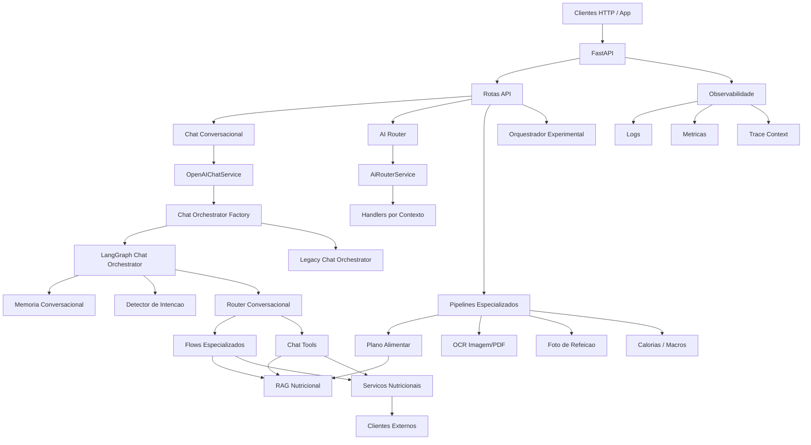
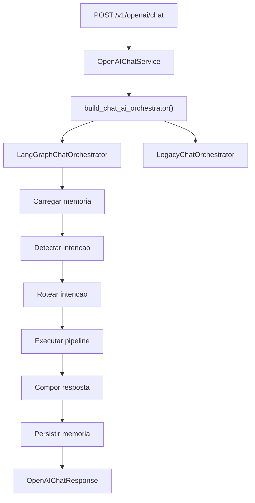
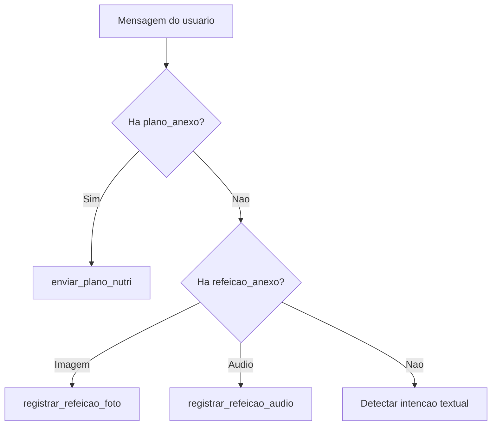
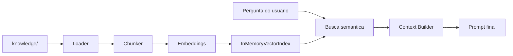

# Vidasync Multiagents IA

Backend FastAPI para agentes e fluxos de IA focados em nutricao, alimentacao, OCR de materiais nutricionais, analise multimodal de refeicoes, parsing de plano alimentar, RAG nutricional e chat conversacional.

Este README descreve a arquitetura real do projeto hoje, com foco em:
- o que ja existe e esta ligado
- como os modulos se conectam
- quais partes sao experimentais
- quais partes ainda sao scaffold e nao estao ativas

## Sumario

- [Visao Geral](#visao-geral)
- [Estado Atual Da Arquitetura](#estado-atual-da-arquitetura)
- [Mapa Geral Do Sistema](#mapa-geral-do-sistema)
- [Entradas HTTP Reais](#entradas-http-reais)
- [Camadas Da Arquitetura](#camadas-da-arquitetura)
- [Arquitetura Do Chat Conversacional](#arquitetura-do-chat-conversacional)
- [Fluxos Do Chat Por Intencao](#fluxos-do-chat-por-intencao)
- [Guardrails E Acoes De UI](#guardrails-e-acoes-de-ui)
- [Multimodal No Chat](#multimodal-no-chat)
- [AI Router Interno](#ai-router-interno)
- [Pipeline De Plano Alimentar](#pipeline-de-plano-alimentar)
- [Servicos Especializados](#servicos-especializados)
- [RAG Nutricional](#rag-nutricional)
- [Integracoes Externas](#integracoes-externas)
- [Observabilidade](#observabilidade)
- [Estrutura De Pastas](#estrutura-de-pastas)
- [Configuracoes Principais](#configuracoes-principais)
- [Rodando Localmente](#rodando-localmente)
- [Testes](#testes)
- [Scaffold Em Progresso](#scaffold-em-progresso)

## Visao Geral

Hoje o projeto tem quatro blocos principais:

1. API HTTP em FastAPI.
2. Servicos especializados de IA e nutricao.
3. Orquestracao de fluxos com opcao entre engine legada e LangGraph.
4. Infra de suporte: RAG, observabilidade, clientes externos e memoria conversacional.

O sistema nao e um "multiagente generico" em tudo. Na pratica ele e um backend modular com:
- um chat conversacional principal
- pipelines especializados por tarefa
- alguns fluxos multimodais
- uma camada de RAG nutricional
- um orquestrador generico experimental em paralelo

## Estado Atual Da Arquitetura

### O que ja esta ativo

- `POST /v1/openai/chat` como frente principal de chat conversacional.
- `POST /ai/router` para roteamento interno de tarefas especializadas.
- pipelines para OCR de imagem, OCR de PDF, normalizacao e estruturacao de plano alimentar.
- agentes de foto para identificar comida e estimar porcoes.
- servicos estruturados para calorias, macros, porcoes, receitas e substituicoes.
- RAG nutricional com ingestao simples e indice vetorial em memoria.
- observabilidade com logs estruturados, metricas Prometheus e `trace_id`.

### O que e experimental

- `POST /orchestrate` usando um grafo generico em [`graph.py`](/C:/Users/Admin/IdeaProjects/vidasync-multiagents-ia/src/vidasync_multiagents_ia/graph.py).

### O que ainda nao esta ativo

- a nova frente dedicada `nutri_chat`:
  - [`api/routes/nutri_chat.py`](/C:/Users/Admin/IdeaProjects/vidasync-multiagents-ia/src/vidasync_multiagents_ia/api/routes/nutri_chat.py)
  - [`services/nutri_chat_service.py`](/C:/Users/Admin/IdeaProjects/vidasync-multiagents-ia/src/vidasync_multiagents_ia/services/nutri_chat_service.py)
  - [`schemas/nutri_chat.py`](/C:/Users/Admin/IdeaProjects/vidasync-multiagents-ia/src/vidasync_multiagents_ia/schemas/nutri_chat.py)

Esses arquivos existem so como scaffold neste momento e nao estao ligados ao roteador principal.

## Mapa Geral Do Sistema



## Entradas HTTP Reais

As rotas abaixo estao realmente incluidas em [`api/router.py`](/C:/Users/Admin/IdeaProjects/vidasync-multiagents-ia/src/vidasync_multiagents_ia/api/router.py).

### Sistema

- `GET /health`
- `GET /metrics`

### Chat e orquestracao

- `POST /v1/openai/chat`
- `POST /ai/router`
- `POST /orchestrate`

### Agentes especializados

- `POST /agentes/audio/transcrever`
- `POST /agentes/fotos/identificar-comida`
- `POST /agentes/fotos/estimar-porcoes`
- `POST /agentes/texto/extrair-porcoes`
- `POST /agentes/imagens/transcrever-texto`
- `POST /agentes/documentos/transcrever-pdf`
- `POST /agentes/texto/estruturar-plano-alimentar`
- `POST /agentes/documentos/normalizar-texto-imagens`
- `POST /agentes/documentos/normalizar-texto-pdf`

### Dados nutricionais e catalogos

- `POST /tbca/search`
- `POST /taco-online/food`
- `POST /open-food-facts/search`

### Rotas de debug condicionais

So entram quando a flag de debug correspondente estiver habilitada:

- `POST /agentes/pipeline-foto-calorias`
- `POST /agentes/pipeline-plano-imagem`
- `POST /agentes/pipeline-plano-e2e-temporario`

## Camadas Da Arquitetura

| Camada | Responsabilidade | Modulos principais |
|---|---|---|
| API | Expor endpoints HTTP e injetar dependencias | [`main.py`](/C:/Users/Admin/IdeaProjects/vidasync-multiagents-ia/src/vidasync_multiagents_ia/main.py), [`api/router.py`](/C:/Users/Admin/IdeaProjects/vidasync-multiagents-ia/src/vidasync_multiagents_ia/api/router.py), [`api/dependencies.py`](/C:/Users/Admin/IdeaProjects/vidasync-multiagents-ia/src/vidasync_multiagents_ia/api/dependencies.py) |
| Chat | Entrada principal conversacional | [`openai_chat_service.py`](/C:/Users/Admin/IdeaProjects/vidasync-multiagents-ia/src/vidasync_multiagents_ia/services/openai_chat_service.py) |
| Orquestracao | Trocar engine sem quebrar contrato | [`services/orchestration/chat_orchestrator.py`](/C:/Users/Admin/IdeaProjects/vidasync-multiagents-ia/src/vidasync_multiagents_ia/services/orchestration/chat_orchestrator.py), [`chat_factory.py`](/C:/Users/Admin/IdeaProjects/vidasync-multiagents-ia/src/vidasync_multiagents_ia/services/orchestration/chat_factory.py) |
| Fluxos especializados | Resolver intencoes ou tarefas especificas | `chat_*_flow_service.py`, `*_service.py` |
| Chat tools | Operacoes reusaveis e simples para o chat | [`services/chat_tools/`](/C:/Users/Admin/IdeaProjects/vidasync-multiagents-ia/src/vidasync_multiagents_ia/services/chat_tools) |
| RAG | Ingestao, embeddings, indice, busca e contexto | [`rag/`](/C:/Users/Admin/IdeaProjects/vidasync-multiagents-ia/src/vidasync_multiagents_ia/rag) |
| Clientes externos | OpenAI e fontes nutricionais externas | [`clients/`](/C:/Users/Admin/IdeaProjects/vidasync-multiagents-ia/src/vidasync_multiagents_ia/clients) |
| Observabilidade | Logs, metricas e contexto de rastreio | [`observability/`](/C:/Users/Admin/IdeaProjects/vidasync-multiagents-ia/src/vidasync_multiagents_ia/observability) |

## Arquitetura Do Chat Conversacional

O chat principal entra por [`POST /v1/openai/chat`](/C:/Users/Admin/IdeaProjects/vidasync-multiagents-ia/src/vidasync_multiagents_ia/api/routes/openai_chat.py).

### Fluxo principal



### Ponto de entrada

- Servico: [`OpenAIChatService`](/C:/Users/Admin/IdeaProjects/vidasync-multiagents-ia/src/vidasync_multiagents_ia/services/openai_chat_service.py)
- Contrato: [`OpenAIChatRequest`](/C:/Users/Admin/IdeaProjects/vidasync-multiagents-ia/src/vidasync_multiagents_ia/schemas/openai_chat.py) e [`OpenAIChatResponse`](/C:/Users/Admin/IdeaProjects/vidasync-multiagents-ia/src/vidasync_multiagents_ia/schemas/openai_chat.py)
- O contrato de resposta do chat agora tambem pode devolver `roteamento.acoes_ui` para o front renderizar CTA dentro da conversa.

### Contrato estavel de orquestracao

O chat nao depende diretamente de LangGraph. Ele depende de uma porta estavel:

- [`AiOrchestrator`](/C:/Users/Admin/IdeaProjects/vidasync-multiagents-ia/src/vidasync_multiagents_ia/services/orchestration/chat_orchestrator.py)
- [`AiOrchestratorRequest`](/C:/Users/Admin/IdeaProjects/vidasync-multiagents-ia/src/vidasync_multiagents_ia/services/orchestration/chat_orchestrator.py)
- [`AiOrchestratorResponse`](/C:/Users/Admin/IdeaProjects/vidasync-multiagents-ia/src/vidasync_multiagents_ia/services/orchestration/chat_orchestrator.py)

Isso permite trocar entre:
- [`LangGraphChatOrchestrator`](/C:/Users/Admin/IdeaProjects/vidasync-multiagents-ia/src/vidasync_multiagents_ia/services/orchestration/chat_langgraph_orchestrator.py)
- [`LegacyChatOrchestrator`](/C:/Users/Admin/IdeaProjects/vidasync-multiagents-ia/src/vidasync_multiagents_ia/services/orchestration/chat_legacy_orchestrator.py)

### Grafo atual do chat

O grafo LangGraph atual e pequeno e objetivo:


### Memoria conversacional

Memoria e gerida por [`ChatMemoryService`](/C:/Users/Admin/IdeaProjects/vidasync-multiagents-ia/src/vidasync_multiagents_ia/services/chat_memory_service.py).

Hoje ela oferece:
- turnos recentes em memoria
- resumo incremental quando o historico cresce
- metadados de conversa
- `conversation_id`
- contexto final para prompt

Essa memoria e simples, em processo, e adequada para o estagio atual do projeto.

## Fluxos Do Chat Por Intencao

A intencao e detectada por heuristica em [`chat_intencao_service.py`](/C:/Users/Admin/IdeaProjects/vidasync-multiagents-ia/src/vidasync_multiagents_ia/services/chat_intencao_service.py) e despachada por [`chat_conversacional_router_service.py`](/C:/Users/Admin/IdeaProjects/vidasync-multiagents-ia/src/vidasync_multiagents_ia/services/chat_conversacional_router_service.py).

### Mapa de intencao para pipeline

| Intencao | Destino atual | Tipo |
|---|---|---|
| `pedir_receitas` | [`ChatReceitasFlowService`](/C:/Users/Admin/IdeaProjects/vidasync-multiagents-ia/src/vidasync_multiagents_ia/services/chat_receitas_flow_service.py) | fluxo |
| `pedir_substituicoes` | [`ChatSubstituicoesFlowService`](/C:/Users/Admin/IdeaProjects/vidasync-multiagents-ia/src/vidasync_multiagents_ia/services/chat_substituicoes_flow_service.py) | fluxo |
| `pedir_dicas` | `consultar_conhecimento_nutricional` | tool |
| `perguntar_calorias` | [`ChatCaloriasMacrosFlowService`](/C:/Users/Admin/IdeaProjects/vidasync-multiagents-ia/src/vidasync_multiagents_ia/services/chat_calorias_macros_flow_service.py) | fluxo |
| `cadastrar_pratos` | [`ChatCadastroRefeicoesFlowService`](/C:/Users/Admin/IdeaProjects/vidasync-multiagents-ia/src/vidasync_multiagents_ia/services/chat_cadastro_refeicoes_flow_service.py) | fluxo |
| `calcular_imc` | `calcular_imc` | tool |
| `registrar_refeicao_foto` | [`ChatRefeicaoMultimodalFlowService.executar_foto`](/C:/Users/Admin/IdeaProjects/vidasync-multiagents-ia/src/vidasync_multiagents_ia/services/chat_refeicao_multimodal_flow_service.py) | fluxo |
| `registrar_refeicao_audio` | [`ChatRefeicaoMultimodalFlowService.executar_audio`](/C:/Users/Admin/IdeaProjects/vidasync-multiagents-ia/src/vidasync_multiagents_ia/services/chat_refeicao_multimodal_flow_service.py) | fluxo |
| `enviar_plano_nutri` | [`ChatPlanoAlimentarMultimodalFlowService`](/C:/Users/Admin/IdeaProjects/vidasync-multiagents-ia/src/vidasync_multiagents_ia/services/chat_plano_alimentar_multimodal_flow_service.py) | fluxo |
| `conversa_geral` | handler conversacional simples | fallback |

### Observacao importante

`conversa_geral` agora usa um prompt curto e proprio para app:
- maximo de 3 frases curtas ou 4 bullets curtos
- saudacao breve
- recusa curta quando sair do tema

Esse ajuste foi feito para o chat nao responder como um artigo longo.

## Guardrails E Acoes De UI

O chat agora tem uma camada deterministica de guardrails antes dos handlers principais:

- bloquear conteudo improprio ou sexualizado
- redirecionar para fluxos que ja existem no app
- barrar quantidades fora da faixa validada no chat

### Pipeline especial

Quando um guardrail dispara, o roteamento passa a usar:

- `pipeline = "guardrail_chat"`

Isso permite ao front diferenciar facilmente uma resposta normal de uma resposta que pede acao do usuario.

### Contrato para o front

Quando houver redirecionamento, a API pode devolver uma lista em:

- `roteamento.acoes_ui`

Cada item segue o schema `ChatUIAction` e hoje usa:

- `tipo`: `open_app_feature`
- `action_id`: identificador estavel para o front
- `label`: texto do botao
- `target`: destino logico da tela/feature
- `variant`: estilo sugerido
- `payload`: metadados auxiliares

Exemplo simplificado:

```json
{
  "response": "Para contar calorias ou macros, use a tela de calorias do app.",
  "roteamento": {
    "pipeline": "guardrail_chat",
    "handler": "handler_guardrail_redirecionar_calorias",
    "acoes_ui": [
      {
        "tipo": "open_app_feature",
        "action_id": "open_calorie_counter",
        "label": "Abrir calorias",
        "target": "calorie_counter",
        "variant": "primary",
        "payload": {
          "feature": "contagem_calorias"
        }
      }
    ]
  }
}
```

### Casos cobertos hoje

Os guardrails atuais redirecionam o usuario quando o pedido pertence a uma feature nativa do app, por exemplo:

- contagem de calorias e macros
- cadastro de pratos
- refeicao por foto
- refeicao por audio
- hidratacao
- troca ou recuperacao de senha

### Targets atuais

Os `action_id` e `target` atualmente documentados sao:

| action_id | target | Uso |
|---|---|---|
| `open_calorie_counter` | `calorie_counter` | abrir tela de calorias/macros |
| `open_saved_dishes` | `saved_dishes` | abrir meus pratos / cadastro |
| `open_meal_photo` | `meal_photo` | abrir fluxo de refeicao por foto |
| `open_meal_audio` | `meal_audio` | abrir fluxo de refeicao por audio |
| `open_hydration` | `hydration` | abrir tela de agua |
| `open_security_settings` | `security_settings` | abrir seguranca/senha |

### Observacao de produto

Se o app ganhar novas features que devam ser abertas a partir do chat, a recomendacao e expandir essa tabela com novos `action_id` estaveis em vez de fazer o front inferir algo a partir do texto livre.

## Multimodal No Chat

O chat ja aceita anexos estruturados no request:
- plano alimentar em imagem ou PDF
- refeicao em imagem ou audio

### Regra de precedencia

Quando existe anexo, o roteador da prioridade ao tipo de midia antes da intencao textual:



### Fluxos multimodais existentes

- [`ChatRefeicaoMultimodalFlowService`](/C:/Users/Admin/IdeaProjects/vidasync-multiagents-ia/src/vidasync_multiagents_ia/services/chat_refeicao_multimodal_flow_service.py)
  - foto de refeicao
  - audio descrevendo refeicao
- [`ChatPlanoAlimentarMultimodalFlowService`](/C:/Users/Admin/IdeaProjects/vidasync-multiagents-ia/src/vidasync_multiagents_ia/services/chat_plano_alimentar_multimodal_flow_service.py)
  - texto
  - imagem
  - PDF

## AI Router Interno

[`AiRouterService`](/C:/Users/Admin/IdeaProjects/vidasync-multiagents-ia/src/vidasync_multiagents_ia/services/ai_router_service.py) e um roteador tecnico para contextos internos. Ele nao substitui o chat conversacional.

### Contextos realmente suportados hoje

| Contexto | Handler atual |
|---|---|
| `chat` | [`OpenAIChatService`](/C:/Users/Admin/IdeaProjects/vidasync-multiagents-ia/src/vidasync_multiagents_ia/services/openai_chat_service.py) |
| `openai_chat` | [`OpenAIChatService`](/C:/Users/Admin/IdeaProjects/vidasync-multiagents-ia/src/vidasync_multiagents_ia/services/openai_chat_service.py) |
| `identificar_fotos` | [`FotoAlimentosService.identificar_comida`](/C:/Users/Admin/IdeaProjects/vidasync-multiagents-ia/src/vidasync_multiagents_ia/services/foto_alimentos_service.py) |
| `estimar_porcoes_do_prato` | [`FotoAlimentosService.estimar_porcoes`](/C:/Users/Admin/IdeaProjects/vidasync-multiagents-ia/src/vidasync_multiagents_ia/services/foto_alimentos_service.py) |
| `transcrever_audio_usuario` | [`AudioTranscricaoService`](/C:/Users/Admin/IdeaProjects/vidasync-multiagents-ia/src/vidasync_multiagents_ia/services/audio_transcricao_service.py) |
| `transcrever_texto_pdf` | [`PdfTextoService`](/C:/Users/Admin/IdeaProjects/vidasync-multiagents-ia/src/vidasync_multiagents_ia/services/pdf_texto_service.py) |
| `calcular_calorias_texto` | [`CaloriasTextoService`](/C:/Users/Admin/IdeaProjects/vidasync-multiagents-ia/src/vidasync_multiagents_ia/services/calorias_texto_service.py) |

### Importante

Este README evita listar contextos que nao estao registrados em `_resolve_handler`. Se voce adicionar novos contextos ao `AiRouterService`, este trecho deve ser atualizado.

## Pipeline De Plano Alimentar

O pipeline de plano alimentar tem uma arquitetura propria, separada do chat.

### Orquestracao

- Fabrica: [`services/orchestration/factory.py`](/C:/Users/Admin/IdeaProjects/vidasync-multiagents-ia/src/vidasync_multiagents_ia/services/orchestration/factory.py)
- Engine LangGraph: [`plano_pipeline_langgraph_orchestrator.py`](/C:/Users/Admin/IdeaProjects/vidasync-multiagents-ia/src/vidasync_multiagents_ia/services/orchestration/plano_pipeline_langgraph_orchestrator.py)
- Engine legada: [`plano_pipeline_legacy_orchestrator.py`](/C:/Users/Admin/IdeaProjects/vidasync-multiagents-ia/src/vidasync_multiagents_ia/services/orchestration/plano_pipeline_legacy_orchestrator.py)

### Fluxo


### Servicos envolvidos

- [`ImagemTextoService`](/C:/Users/Admin/IdeaProjects/vidasync-multiagents-ia/src/vidasync_multiagents_ia/services/imagem_texto_service.py)
- [`PdfTextoService`](/C:/Users/Admin/IdeaProjects/vidasync-multiagents-ia/src/vidasync_multiagents_ia/services/pdf_texto_service.py)
- [`PlanoTextoNormalizadoService`](/C:/Users/Admin/IdeaProjects/vidasync-multiagents-ia/src/vidasync_multiagents_ia/services/plano_texto_normalizado_service.py)
- [`PlanoAlimentarService`](/C:/Users/Admin/IdeaProjects/vidasync-multiagents-ia/src/vidasync_multiagents_ia/services/plano_alimentar_service.py)

### Pipelines temporarios e debug

Ha tambem servicos auxiliares para testes ponta a ponta:
- [`PlanoPipelineE2ETesteService`](/C:/Users/Admin/IdeaProjects/vidasync-multiagents-ia/src/vidasync_multiagents_ia/services/plano_pipeline_e2e_teste_service.py)
- [`PlanoImagemPipelineTesteService`](/C:/Users/Admin/IdeaProjects/vidasync-multiagents-ia/src/vidasync_multiagents_ia/services/plano_imagem_pipeline_teste_service.py)

## Servicos Especializados

### OCR e extracao

| Servico | Responsabilidade |
|---|---|
| [`ImagemTextoService`](/C:/Users/Admin/IdeaProjects/vidasync-multiagents-ia/src/vidasync_multiagents_ia/services/imagem_texto_service.py) | OCR de imagens; processa multiplas imagens em paralelo |
| [`PdfTextoService`](/C:/Users/Admin/IdeaProjects/vidasync-multiagents-ia/src/vidasync_multiagents_ia/services/pdf_texto_service.py) | OCR/transcricao de PDFs |
| [`AudioTranscricaoService`](/C:/Users/Admin/IdeaProjects/vidasync-multiagents-ia/src/vidasync_multiagents_ia/services/audio_transcricao_service.py) | Transcricao de audio do usuario |
| [`FrasePorcoesService`](/C:/Users/Admin/IdeaProjects/vidasync-multiagents-ia/src/vidasync_multiagents_ia/services/frase_porcoes_service.py) | Extrai porcoes a partir de texto livre |

### Foto de refeicao

| Servico | Responsabilidade |
|---|---|
| [`FotoAlimentosService.identificar_comida`](/C:/Users/Admin/IdeaProjects/vidasync-multiagents-ia/src/vidasync_multiagents_ia/services/foto_alimentos_service.py) | Verifica se a imagem contem refeicao/comida |
| [`FotoAlimentosService.estimar_porcoes`](/C:/Users/Admin/IdeaProjects/vidasync-multiagents-ia/src/vidasync_multiagents_ia/services/foto_alimentos_service.py) | Estima porcoes do prato |
| [`FotoAlimentosService.identificar_nome_prato`](/C:/Users/Admin/IdeaProjects/vidasync-multiagents-ia/src/vidasync_multiagents_ia/services/foto_alimentos_service.py) | Sugere nome do prato |

### Nutricao estruturada

| Servico | Responsabilidade |
|---|---|
| [`CaloriasTextoService`](/C:/Users/Admin/IdeaProjects/vidasync-multiagents-ia/src/vidasync_multiagents_ia/services/calorias_texto_service.py) | Calorias/macros por texto; combina lookup estruturado e fallback via LLM |
| [`ChatCaloriasMacrosFlowService`](/C:/Users/Admin/IdeaProjects/vidasync-multiagents-ia/src/vidasync_multiagents_ia/services/chat_calorias_macros_flow_service.py) | Fluxo conversacional de calorias e macros |
| [`ChatReceitasFlowService`](/C:/Users/Admin/IdeaProjects/vidasync-multiagents-ia/src/vidasync_multiagents_ia/services/chat_receitas_flow_service.py) | Sugestao de receitas |
| [`ChatSubstituicoesFlowService`](/C:/Users/Admin/IdeaProjects/vidasync-multiagents-ia/src/vidasync_multiagents_ia/services/chat_substituicoes_flow_service.py) | Substituicoes alimentares |
| [`ChatCadastroRefeicoesFlowService`](/C:/Users/Admin/IdeaProjects/vidasync-multiagents-ia/src/vidasync_multiagents_ia/services/chat_cadastro_refeicoes_flow_service.py) | Cadastro e confirmacao de refeicoes |

### Plano alimentar

| Servico | Responsabilidade |
|---|---|
| [`PlanoTextoNormalizadoService`](/C:/Users/Admin/IdeaProjects/vidasync-multiagents-ia/src/vidasync_multiagents_ia/services/plano_texto_normalizado_service.py) | Transformar OCR bruto em texto limpo e coerente |
| [`PlanoAlimentarService`](/C:/Users/Admin/IdeaProjects/vidasync-multiagents-ia/src/vidasync_multiagents_ia/services/plano_alimentar_service.py) | Estruturar plano alimentar em saida operacional |

## RAG Nutricional

O RAG atual e simples por design e reaproveitavel.

### Componentes

| Componente | Arquivo |
|---|---|
| Loader | [`rag/loaders.py`](/C:/Users/Admin/IdeaProjects/vidasync-multiagents-ia/src/vidasync_multiagents_ia/rag/loaders.py) |
| Chunker | [`rag/chunking.py`](/C:/Users/Admin/IdeaProjects/vidasync-multiagents-ia/src/vidasync_multiagents_ia/rag/chunking.py) |
| Embeddings | [`rag/embeddings.py`](/C:/Users/Admin/IdeaProjects/vidasync-multiagents-ia/src/vidasync_multiagents_ia/rag/embeddings.py) |
| Indice vetorial | [`rag/vector_index.py`](/C:/Users/Admin/IdeaProjects/vidasync-multiagents-ia/src/vidasync_multiagents_ia/rag/vector_index.py) |
| Context builder | [`rag/context_builder.py`](/C:/Users/Admin/IdeaProjects/vidasync-multiagents-ia/src/vidasync_multiagents_ia/rag/context_builder.py) |
| Servico | [`rag/service.py`](/C:/Users/Admin/IdeaProjects/vidasync-multiagents-ia/src/vidasync_multiagents_ia/rag/service.py) |
| Fachada | [`rag/vector_store.py`](/C:/Users/Admin/IdeaProjects/vidasync-multiagents-ia/src/vidasync_multiagents_ia/rag/vector_store.py) |

### Fluxo



### Caracteristicas atuais

- fonte principal: pasta [`knowledge/`](/C:/Users/Admin/IdeaProjects/vidasync-multiagents-ia/knowledge)
- formatos bem suportados:
  - `.md`
  - `.txt`
  - `.json` simples
- chunking com janela deslizante
- indice em memoria
- embeddings OpenAI ou hash
- sem reranker
- sem multiplas colecoes
- sem persistencia vetorial sofisticada

### Script de ingestao

Use:

- [`scripts/ingest_nutrition_knowledge.py`](/C:/Users/Admin/IdeaProjects/vidasync-multiagents-ia/scripts/ingest_nutrition_knowledge.py)

Exemplo:

```powershell
$env:PYTHONPATH='src'
python scripts\ingest_nutrition_knowledge.py --docs-dir knowledge --query "como melhorar fibra alimentar" --top-k 3
```

## Integracoes Externas

### OpenAI

Cliente central:
- [`OpenAIClient`](/C:/Users/Admin/IdeaProjects/vidasync-multiagents-ia/src/vidasync_multiagents_ia/clients/openai_client.py)

Responsabilidades:
- geracao de texto
- saida JSON a partir de texto
- analise de imagem
- OCR de imagem
- OCR de PDF
- transcricao de audio

### Fontes nutricionais

| Integracao | Cliente | Uso principal |
|---|---|---|
| TBCA | [`TBCAClient`](/C:/Users/Admin/IdeaProjects/vidasync-multiagents-ia/src/vidasync_multiagents_ia/clients/tbca_client.py) | busca e leitura de composicao nutricional |
| TACO Online | [`TacoOnlineClient`](/C:/Users/Admin/IdeaProjects/vidasync-multiagents-ia/src/vidasync_multiagents_ia/clients/taco_online_client.py) | lookup estruturado de alimentos |
| Open Food Facts | [`OpenFoodFactsClient`](/C:/Users/Admin/IdeaProjects/vidasync-multiagents-ia/src/vidasync_multiagents_ia/clients/open_food_facts_client.py) | busca de produtos e fallback estruturado |

### Observacao importante

Apesar do projeto ter integracao com TBCA, parte do fluxo estruturado atual de calorias/macros esta mais acoplada a TACO Online e Open Food Facts em [`calorias_texto_service.py`](/C:/Users/Admin/IdeaProjects/vidasync-multiagents-ia/src/vidasync_multiagents_ia/services/calorias_texto_service.py).

## Observabilidade

Observabilidade esta centralizada em [`observability/`](/C:/Users/Admin/IdeaProjects/vidasync-multiagents-ia/src/vidasync_multiagents_ia/observability).

### Logs

- setup: [`logging_setup.py`](/C:/Users/Admin/IdeaProjects/vidasync-multiagents-ia/src/vidasync_multiagents_ia/observability/logging_setup.py)
- middleware HTTP: [`http_logging.py`](/C:/Users/Admin/IdeaProjects/vidasync-multiagents-ia/src/vidasync_multiagents_ia/observability/http_logging.py)

Caracteristicas:
- logs estruturados
- suporte a saida JSON
- `request_id` e `trace_id`
- preview de payload
- compatibilidade com emojis no console Windows

### Metricas

- [`metrics.py`](/C:/Users/Admin/IdeaProjects/vidasync-multiagents-ia/src/vidasync_multiagents_ia/observability/metrics.py)

Hoje ha metricas para:
- HTTP
- chamadas externas
- estagios do chat
- tool calls
- tool failures
- fallbacks
- AI router
- uso de RAG

### Contexto

- [`context.py`](/C:/Users/Admin/IdeaProjects/vidasync-multiagents-ia/src/vidasync_multiagents_ia/observability/context.py)

Esse modulo ajuda a propagar:
- `trace_id`
- contexto por thread
- submissoes com contexto preservado

## Estrutura De Pastas

```text
src/vidasync_multiagents_ia/
  api/
    dependencies.py
    router.py
    routes/
  clients/
  core/
  observability/
  rag/
  schemas/
  services/
    chat_tools/
    orchestration/
    plano_alimentar_pipeline/
  graph.py
  main.py

knowledge/
docs/
scripts/
tests/
```

## Configuracoes Principais

As configuracoes ficam em:

- [`config.py`](/C:/Users/Admin/IdeaProjects/vidasync-multiagents-ia/src/vidasync_multiagents_ia/config.py)

Variaveis mais importantes:

| Configuracao | Papel |
|---|---|
| `OPENAI_API_KEY` | autenticacao OpenAI |
| `OPENAI_MODEL` | modelo padrao do chat e servicos |
| `CHAT_ORCHESTRATOR_ENGINE` | `langgraph` ou `legacy` para o chat |
| `PLANO_PIPELINE_ORCHESTRATOR_ENGINE` | engine do pipeline de plano |
| `VIDASYNC_DOCS_DIR` | diretorio da base de conhecimento |
| `RAG_*` | controle de embeddings, chunking e recuperacao |
| flags de debug | habilitam rotas temporarias de teste |

## Rodando Localmente

### 1. Instale dependencias

Use o fluxo do projeto ja configurado no ambiente local.

### 2. Configure ambiente

Exemplo minimo:

```powershell
$env:OPENAI_API_KEY="sua-chave"
$env:PYTHONPATH="src"
```

### 3. Suba a API

```powershell
uvicorn vidasync_multiagents_ia.main:app --reload
```

### 4. Teste endpoints principais

Health:

```powershell
curl http://127.0.0.1:8000/health
```

Chat:

```powershell
curl -X POST http://127.0.0.1:8000/v1/openai/chat `
  -H "Content-Type: application/json" `
  -d "{\"prompt\":\"Como melhorar fibra alimentar?\"}"
```

## Testes

Os testes estao em [`tests/`](/C:/Users/Admin/IdeaProjects/vidasync-multiagents-ia/tests).

Exemplos uteis:

```powershell
pytest -q tests\test_chat_intencao_service.py
pytest -q tests\test_chat_conversacional_router_service.py
pytest -q tests\test_chat_tools_executor.py
pytest -q tests\test_openai_chat_service.py
pytest -q tests\test_rag_service.py
```

Para cobertura rapida do RAG e logging:

```powershell
pytest -q tests\test_rag_loaders.py tests\test_rag_service.py tests\test_rag_vector_store.py tests\test_logging_setup_message_normalization.py
```

## Scaffold Em Progresso

Existe uma nova frente pensada para um chat nutricional dedicado, mas ela ainda nao foi conectada:

- [`api/routes/nutri_chat.py`](/C:/Users/Admin/IdeaProjects/vidasync-multiagents-ia/src/vidasync_multiagents_ia/api/routes/nutri_chat.py)
- [`services/nutri_chat_service.py`](/C:/Users/Admin/IdeaProjects/vidasync-multiagents-ia/src/vidasync_multiagents_ia/services/nutri_chat_service.py)
- [`schemas/nutri_chat.py`](/C:/Users/Admin/IdeaProjects/vidasync-multiagents-ia/src/vidasync_multiagents_ia/schemas/nutri_chat.py)

Status atual:
- arquivos placeholder
- sem logica implementada
- nao incluido em [`api/router.py`](/C:/Users/Admin/IdeaProjects/vidasync-multiagents-ia/src/vidasync_multiagents_ia/api/router.py)

Ou seja: hoje o chat ativo continua sendo o fluxo de [`/v1/openai/chat`](/C:/Users/Admin/IdeaProjects/vidasync-multiagents-ia/src/vidasync_multiagents_ia/api/routes/openai_chat.py).

## Referencia Complementar

Se voce quiser comparar a arquitetura atual com a arquitetura alvo documentada, veja:

- [`docs/CONTRATOS_ARQUITETURA_ALVO.md`](/C:/Users/Admin/IdeaProjects/vidasync-multiagents-ia/docs/CONTRATOS_ARQUITETURA_ALVO.md)

Esse documento deve ser lido como referencia de direcao, nao como retrato exato do codigo em producao.
