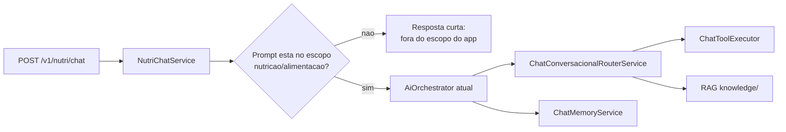
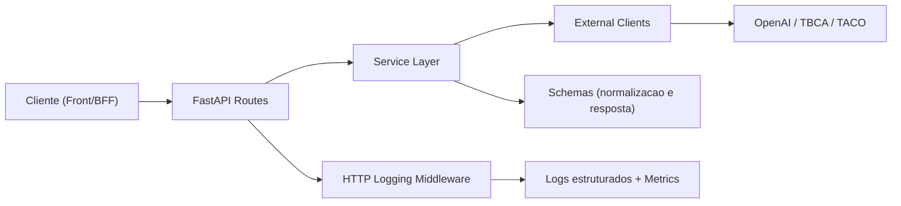
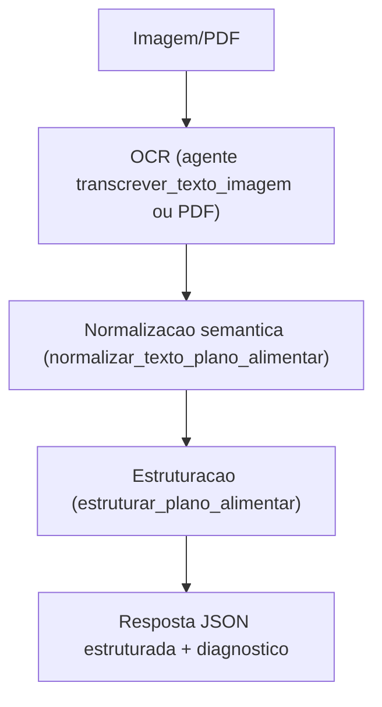

# VidaSync Multiagents IA

Backend FastAPI para orquestracao de agentes de IA focados em:
- alimentos e macros (TBCA / TACO Online)
- transcricao (audio, imagem, PDF)
- normalizacao semantica de documentos
- estruturacao de plano alimentar

## Status Atual
- API funcional com rotas por dominio (`agentes`, `tbca`, `taco-online`, `system`).
- Observabilidade completa: logs estruturados JSON/texto, request/response middleware, metricas.
- Suite de testes automatizados cobrindo rotas, servicos e parsers.

## Nova Frente: Chat Conversacional De Nutricao
Objetivo desta frente: abrir um chat conversacional focado apenas em nutricao e alimentacao dentro do contexto do app, sem criar uma segunda arquitetura paralela.

### Mapa Rapido
| Bloco | Direcao recomendada |
|---|---|
| Entrada HTTP | `[REUSE]` padrao atual de `api/routes` + `api/dependencies` |
| Contratos | `[REUSE]` `OpenAIChatRequest` e `OpenAIChatResponse` na primeira etapa |
| Orquestracao | `[REUSE]` `AiOrchestrator` + engine atual (`langgraph` ou `legacy`) |
| Roteamento | `[REUSE]` `ChatConversacionalRouterService` com ajuste pequeno e controlado |
| Tools | `[REUSE]` `ChatToolExecutor` + tools nutricionais ja existentes |
| Memoria | `[REUSE]` `ChatMemoryService` |
| RAG | `[REUSE]` `rag/vector_store.py` + `knowledge/` |
| Observabilidade | `[REUSE]` middleware, logging estruturado e metricas atuais |
| Nova camada | `[NEW]` somente uma rota dedicada e um service fino para essa frente |
| Evitar agora | `[AVOID]` multiagentes, subgrafos novos, planners, novos clients, nova stack RAG |



### 1. Diagnostico Do Que Ja Existe
| Area | O que ja existe no projeto | Evidencia no codigo | Leitura para a nova frente |
|---|---|---|---|
| Entrada HTTP | Rota + dependencia para chat | `api/routes/openai_chat.py`, `api/dependencies.py` | Ja existe padrao pronto para expor uma nova frente sem reinventar wiring |
| Service de entrada | Service fino com logs, metricas e contrato estavel | `services/openai_chat_service.py` | O ponto de entrada atual ja separa bem HTTP de orquestracao |
| Orquestracao | Porta estavel + engine `langgraph`/`legacy` | `services/orchestration/chat_orchestrator.py`, `services/orchestration/chat_factory.py` | Nao precisa nascer um novo motor para esse chat |
| Grafo atual | Fluxo simples: entrada -> intencao -> roteamento -> pipeline -> resposta | `services/orchestration/chat_langgraph_orchestrator.py` | O grafo atual ja e simples o bastante para evolucao gradual |
| Fallback sequencial | Orquestrador legado compativel | `services/orchestration/chat_legacy_orchestrator.py` | Mantem rollback simples sem mudar contrato |
| Deteccao de intencao | Heuristica deterministica e barata | `services/chat_intencao_service.py` | Bom ponto de partida antes de pensar em algo mais sofisticado |
| Roteamento de chat | Router central com handlers por intencao | `services/chat_conversacional_router_service.py` | Ja concentra a regra de negocio do chat em um lugar so |
| Tools nutricionais | Executor unico + registry + contratos estaveis | `services/chat_tools/executor.py`, `services/chat_tools/factory.py`, `services/chat_tools/contracts.py` | Ja existe uma base consistente para tool calling simples |
| Dominio nutricional | Tools de calorias, macros, IMC, receitas, substituicoes e conhecimento | `services/chat_tools/nutricao_tools.py` | O nucleo funcional do chat nutricional ja existe |
| Memoria | Memoria curta + resumo acumulado | `services/chat_memory_service.py` | Ja atende bem uma primeira frente conversacional |
| RAG | Fachada simples para ingestao e retrieval | `rag/vector_store.py`, `rag/service.py`, `knowledge/` | Ja existe infra de conhecimento nutricional local |
| Integracoes | TBCA, TACO Online, Open Food Facts, OpenAI | `clients/`, `services/tbca_service.py`, `services/taco_online_service.py`, `services/open_food_facts_service.py` | Nao faz sentido criar novos clients para a mesma finalidade |
| Observabilidade | Logging estruturado, middleware HTTP e metricas | `main.py`, `observability/logging_setup.py`, `observability/metrics.py` | A nova frente deve entrar no mesmo padrao operacional |
| Cobertura de testes | Suite forte para chat, tools, memoria e metricas | `tests/test_openai_chat_*`, `tests/test_chat_*`, `tests/test_rag_*` | Existe base real para evoluir sem voar cego |

#### Partes Que Devem Permanecer Intactas
- `[KEEP]` `POST /v1/openai/chat` e seus contratos, caso ja exista consumo por app/BFF.
- `[KEEP]` `AiOrchestrator` como porta estavel entre service e engine.
- `[KEEP]` `ChatToolExecutor` e os contratos `ChatToolExecutionInput` / `ChatToolExecutionOutput`.
- `[KEEP]` `ChatMemoryService`, `rag/vector_store.py` e os clients nutricionais.
- `[KEEP]` middleware HTTP, metricas e formatacao de logs estruturados.
- `[KEEP]` `knowledge/` como base unica de conhecimento nutricional do app.

### 2. O Que Reaproveitar
| Reaproveitar | Como usar na nova frente | Motivo |
|---|---|---|
| `OpenAIChatRequest` / `OpenAIChatResponse` | Usar na etapa inicial da nova rota | Evita criar schema duplicado sem necessidade real |
| `OpenAIChatService` como referencia de entrada | Copiar o padrao de logging/metricas e manter a camada fina | O formato atual ja esta limpo e facil de manter |
| `build_chat_ai_orchestrator(...)` | Delegar para o orquestrador atual | Reuso maximo sem novo grafo |
| `ChatConversacionalRouterService` | Reusar handlers e pipelines ja existentes | Centraliza dominio do chat em um ponto so |
| `ChatIntencaoService` | Reaproveitar deteccao inicial e complementar apenas se faltar cobertura | Mais simples do que introduzir classificador novo |
| `ChatToolExecutor` + `build_chat_tool_executor(...)` | Reusar tool calling nutricional | Ja tem logs, metricas e tratamento de erro |
| `ChatMemoryService` | Reusar `conversation_id`, resumo e contexto curto | Evita criar memoria paralela |
| `retrieve_context(...)` / `build_context_for_query(...)` | Reusar RAG atual | Ja consulta `knowledge/` e ja esta testado |
| `CaloriasTextoService` | Continuar como base de calorias/macros | Regra nutricional ja consolidada |
| `TBCAService`, `TacoOnlineService`, `OpenFoodFactsService` | Manter como fontes estruturadas | Nao duplicar integracoes nem logica de consulta |
| `logging_setup.py` + `metrics.py` | Seguir exatamente o mesmo padrao de telemetria | Uniformidade operacional e menor custo de suporte |

### 3. O Que Criar De Novo
Minimo recomendado para abrir a nova frente sem duplicar infraestrutura:

| Item novo | Necessidade | Observacao |
|---|---|---|
| `api/routes/nutri_chat.py` | Expor uma frente separada no app | Justificado porque voce quer um chat separado do fluxo atual |
| `services/nutri_chat_service.py` | Ser a camada fina de entrada dessa frente | Deve validar escopo, logar e delegar para o que ja existe |
| Logs dedicados `nutri_chat.*` | Dar visibilidade operacional da nova frente | Reusar o mesmo formato estruturado atual |
| Testes dedicados da rota/service | Garantir que o chat bloqueia fora de escopo e reaproveita o resto | Sem isso, a nova frente pode parecer simples e quebrar facil |

#### O Que Nao Criar Agora
- `[AVOID]` novo schema so porque a rota mudou.
- `[AVOID]` novo orquestrador so para "ter um chat separado".
- `[AVOID]` nova camada de tools ou novo registry.
- `[AVOID]` novo repositorio de conhecimento ou segunda base vetorial.
- `[AVOID]` dependencias novas como planner, judge, guardrail framework ou agent framework adicional.

#### Ajuste Pequeno E Necessario No Comportamento Atual
O ponto que hoje impede reuso total sem cuidado e o handler `conversa_geral`: no fluxo atual ele pode responder qualquer tema. Para a nova frente nutricional, o mais simples e seguro e:

1. barrar prompts claramente fora de nutricao logo na entrada do novo service;
2. quando o pedido estiver em nutricao, continuar reaproveitando o roteamento e as tools atuais;
3. nao abrir um fallback generico fora do dominio do app.

### 4. Estrutura Minima Sugerida
```text
src/vidasync_multiagents_ia/
  api/
    routes/
      openai_chat.py          # manter intacto
      nutri_chat.py           # novo, frente dedicada
  services/
    openai_chat_service.py    # manter intacto
    nutri_chat_service.py     # novo, camada fina
    chat_conversacional_router_service.py
    chat_intencao_service.py
    chat_memory_service.py
    chat_tools/
  rag/
  knowledge/
```

Fluxo minimo sugerido:

```text
request -> rota dedicada -> NutriChatService -> validacao de escopo
       -> orquestrador atual -> router atual -> tools/RAG/memoria atuais
       -> resposta
```

#### Etapas Pequenas E Implementaveis
1. Criar `POST /v1/nutri/chat` reaproveitando request/response atuais.
2. Criar `NutriChatService` com logs estruturados de inicio, bloqueio de escopo, sucesso e falha.
3. Delegar para o orquestrador atual sem mexer no contrato publico do chat existente.
4. Adicionar testes cobrindo:
   - prompt nutricional valido
   - prompt fora de escopo
   - reuso de memoria
   - preservacao de logs/metricas

#### Logs Estruturados Esperados Nessa Frente
- `nutri_chat.started`
- `nutri_chat.scope_blocked`
- `nutri_chat.completed`
- `nutri_chat.failed`

Campos recomendados no `extra`:
- `conversation_id`
- `prompt_chars`
- `usar_memoria`
- `intencao_detectada`
- `pipeline`
- `handler`
- `status`
- `fora_do_escopo`
- `duration_ms`

### 5. Riscos De Complexidade Desnecessaria
| Risco | Por que seria excesso agora | Decisao recomendada |
|---|---|---|
| Novo grafo so para a frente nutricional | Duplica comportamento que ja existe no orquestrador atual | Reusar o grafo atual |
| Novo sistema de memoria | Cria duas verdades para a mesma conversa | Reusar `ChatMemoryService` |
| Novo registry de tools | Duplica contratos e observabilidade | Reusar `ChatToolExecutor` |
| Novo RAG dedicado | Duplica ingestao, indexacao e manutencao da base | Reusar `knowledge/` e `rag/vector_store.py` |
| Novo cliente de LLM ou framework extra | Aumenta custo de manutencao sem ganho imediato | Ficar com OpenAI SDK + stack atual |
| Multiagentes/subgrafos/planner | Complexidade alta para um problema ainda simples | Nao usar nesta etapa |
| Criar schemas paralelos cedo demais | Aumenta superficie de contrato sem prova de necessidade | Reusar schemas atuais primeiro |
| Mexer no endpoint atual em vez de isolar a frente nova | Risco de regressao em consumidores existentes | Criar rota dedicada e manter o fluxo atual intacto |

Resumo pratico:

```text
[REUSE] route pattern + dependencies + service pattern + orchestrator + router + tools + memory + RAG + observability
[NEW]   uma rota dedicada + um service fino + testes da nova frente
[AVOID] novo motor, nova stack, novo RAG, novos clients, multiagentes
```

## Contrato Alvo App-BFF-Agentes
- Documento oficial de contrato e arquitetura alvo: `docs/CONTRATOS_ARQUITETURA_ALVO.md`.

## Stack
- Python 3.11+
- FastAPI + Uvicorn
- OpenAI SDK
- LangGraph / LangChain (base para orquestracao e evolucoes de pipeline)
- RAG base in-memory (loader/chunker/indexacao vetorial) com embeddings hash/OpenAI
- Pytest + Ruff

## Como Rodar
1. Criar ambiente virtual:
```bash
python -m venv .venv
.venv\Scripts\activate
```

2. Instalar dependencias:
```bash
pip install -e .[dev]
```

3. Configurar ambiente:
```bash
copy .env.example .env
```

4. Subir API:
```bash
uvicorn vidasync_multiagents_ia.main:app --reload
```

## Variaveis De Ambiente
| Variavel | Default | Descricao |
|---|---|---|
| `OPENAI_API_KEY` | `""` | Chave da OpenAI |
| `OPENAI_MODEL` | `gpt-4o-mini` | Modelo base de texto/imagem |
| `OPENAI_AUDIO_MODEL` | `gpt-4o-mini-transcribe` | Modelo de transcricao de audio |
| `OPENAI_TIMEOUT_SECONDS` | `60` | Timeout de chamadas OpenAI |
| `AUDIO_MAX_UPLOAD_BYTES` | `8388608` | Limite upload audio (8MB) |
| `AUDIO_RECOMMENDED_MAX_SECONDS` | `45` | Referencia para front |
| `PDF_MAX_UPLOAD_BYTES` | `20971520` | Limite upload PDF (20MB) |
| `VIDASYNC_DOCS_DIR` | `knowledge` | Diretorio base dos documentos da base nutricional |
| `RAG_CHUNK_SIZE` | `800` | Tamanho maximo de chunk textual |
| `RAG_CHUNK_OVERLAP` | `120` | Sobreposicao entre chunks consecutivos |
| `RAG_TOP_K` | `4` | Quantidade padrao de documentos retornados |
| `RAG_MIN_SCORE` | `0.12` | Score minimo de similaridade para considerar um hit |
| `RAG_CONTEXT_MAX_CHARS` | `4000` | Limite de caracteres do contexto enviado ao LLM |
| `RAG_EMBEDDING_PROVIDER` | `auto` | `auto`, `openai` ou `hash` |
| `RAG_EMBEDDING_MODEL` | `text-embedding-3-small` | Modelo de embedding quando provider = `openai` |
| `LOG_LEVEL` | `INFO` | Nivel de log |
| `LOG_FORMAT` | `json` | `json` ou `text` |
| `LOG_JSON_PRETTY` | `false` | JSON identado no console |
| `LOG_HTTP_HEADERS` | `false` | Logar headers de request/response |
| `LOG_HTTP_MAX_BODY_BYTES` | `32768` | Limite de captura de body |
| `LOG_HTTP_MAX_BODY_CHARS` | `4000` | Limite de preview textual |
| `METRICS_ENABLED` | `true` | Liga metricas em memoria |
| `RESPONSE_EXCLUDE_NONE` | `false` | Remove campos `null` globalmente |
| `PLANO_ALIMENTAR_REFEICOES_SECOND_PASS_ENABLED` | `false` | Segundo passe LLM para refeicoes |
| `PLANO_PIPELINE_ORCHESTRATOR_ENGINE` | `langgraph` | Engine do pipeline de plano: `langgraph` ou `legacy` |
| `CHAT_ORCHESTRATOR_ENGINE` | `langgraph` | Engine do chat conversacional: `langgraph` ou `legacy` |
| `CHAT_MEMORY_ENABLED` | `true` | Liga memoria conversacional controlada |
| `CHAT_MEMORY_MAX_TURNS_SHORT_TERM` | `8` | Janela de turnos recentes mantida sem resumo |
| `CHAT_MEMORY_SUMMARY_MAX_CHARS` | `1800` | Limite do resumo acumulado da conversa |
| `CHAT_MEMORY_CONTEXT_MAX_CHARS` | `2200` | Limite do contexto de memoria injetado no prompt |
| `CHAT_MEMORY_MAX_TURN_CHARS` | `320` | Limite de caracteres por turno no contexto |
| `DEBUG_LOCAL_ROUTES_ENABLED` | `true` | Liga rotas temporarias de debug |

## Catalogo De Endpoints
### System
- `GET /health`
- `GET /metrics`

### Orquestracao/Base
- `POST /orchestrate`
- `POST /v1/openai/chat` (inclui `intencao_detectada` + `roteamento` por pipeline)
- `POST /ai/router` (interno, roteamento por `contexto`)

### Agentes De Texto/Plano
- `POST /agentes/texto/extrair-porcoes`
- `POST /agentes/texto/estruturar-plano-alimentar`

### Agentes De Imagem/Foto
- `POST /agentes/imagens/transcrever-texto`
- `POST /agentes/fotos/identificar-comida`
- `POST /agentes/fotos/estimar-porcoes`

### Agentes De Documento
- `POST /agentes/documentos/transcrever-pdf` (multipart/form-data)
- `POST /agentes/documentos/normalizar-texto-imagens`
- `POST /agentes/documentos/normalizar-texto-pdf` (multipart/form-data)

### Integracoes Nutricionais
- `POST /tbca/search`
- `POST /taco-online/food`
- `POST /open-food-facts/search`

### Pipelines Temporarios
- `POST /agentes/pipeline-plano-imagem`
- `POST /agentes/pipeline-plano-e2e-temporario`
- `POST /agentes/pipeline-foto-calorias`
- Habilitada apenas quando `DEBUG_LOCAL_ROUTES_ENABLED=true`.

## Exemplos Rapidos (curl)
### Health
```bash
curl --request GET "http://127.0.0.1:8000/health"
```

### TBCA (body)
```bash
curl --request POST "http://127.0.0.1:8000/tbca/search" \
  --header "Content-Type: application/json" \
  --data "{\"consulta\":\"arroz\",\"gramas\":150}"
```

### TACO Online (body)
```bash
curl --request POST "http://127.0.0.1:8000/taco-online/food" \
  --header "Content-Type: application/json" \
  --data "{\"consulta\":\"feijao carioca cru\",\"gramas\":100}"
```

### Open Food Facts (body)
```bash
curl --request POST "http://127.0.0.1:8000/open-food-facts/search" \
  --header "Content-Type: application/json" \
  --data "{\"consulta\":\"monster energy ultra\",\"gramas\":500,\"page\":1,\"page_size\":5}"
```

### Gerar catalogo local completo da TACO (lote)
```bash
python scripts/build_taco_catalog.py \
  --input knowledge/banco.json \
  --output knowledge/taco_catalog_full.json \
  --delay-seconds 0.25
```

### OCR De Imagens
```bash
curl --request POST "http://127.0.0.1:8000/agentes/imagens/transcrever-texto" \
  --header "Content-Type: application/json" \
  --data "{\"contexto\":\"transcrever_texto_imagem\",\"imagem_urls\":[\"https://i.imgur.com/39gMaUj.png\"],\"idioma\":\"pt-BR\"}"
```

### AI Router Interno (chat)
```bash
curl --request POST "http://127.0.0.1:8000/ai/router" \
  --header "Content-Type: application/json" \
  --data "{\"trace_id\":\"trace-local-001\",\"contexto\":\"chat\",\"idioma\":\"pt-BR\",\"payload\":{\"prompt\":\"Oi, tudo bem?\"}}"
```

### Chat Com Refeicao Por Foto (via BFF/AI Router)
```bash
curl --request POST "http://127.0.0.1:8000/v1/openai/chat" \
  --header "Content-Type: application/json" \
  --data "{\"prompt\":\"Registrar refeicao por foto\",\"refeicao_anexo\":{\"tipo_fonte\":\"imagem\",\"imagem_url\":\"https://example.com/prato.jpg\"}}"
```

## Deteccao e roteamento de intencao no chat (novo)
- Toda chamada em `POST /v1/openai/chat` executa deteccao de intencao antes da resposta de texto.
- A resposta inclui:
  - `intencao_detectada.intencao`
  - `intencao_detectada.confianca`
  - `intencao_detectada.contexto_roteamento`
  - `intencao_detectada.requer_fluxo_estruturado`
  - `intencao_detectada.candidatos` (top candidatos para auditoria/roteamento)
  - `roteamento.pipeline` (ex.: `tool_calculo`, `rag_conhecimento_nutricional`)
  - `roteamento.handler` (handler interno usado)
  - `roteamento.status`, `roteamento.warnings`, `roteamento.precisa_revisao`
  - `roteamento.metadados` (payload tecnico do pipeline acionado)
- Intencoes iniciais suportadas:
  - `enviar_plano_nutri`
  - `pedir_receitas`
  - `pedir_substituicoes`
  - `pedir_dicas`
  - `perguntar_calorias`
  - `cadastrar_pratos`
  - `calcular_imc`
  - `registrar_refeicao_foto`
  - `registrar_refeicao_audio`
  - `conversa_geral`
- Grafo base do chat (LangGraph): `entrada -> detectar_intencao -> rotear_intencao -> executar_pipeline -> compor_resposta -> saida_final`
- Suporte multimodal no proprio chat:
  - `plano_anexo`: pipeline de plano alimentar por imagem/PDF.
  - `refeicao_anexo`:
    - `tipo_fonte=imagem` -> fluxo de registro por foto (identificacao + estimativa de porcoes).
    - `tipo_fonte=audio` -> fluxo de registro por audio (transcricao + interpretacao de porcoes).
  - Regras de prioridade de anexo no roteador:
    - `plano_anexo` tem prioridade maxima.
    - depois `refeicao_anexo`.
- Fluxo dedicado de receitas:
  - `pedir_receitas` usa `handler_fluxo_receitas_personalizadas`.
  - O fluxo combina entendimento de perfil do pedido + contexto da conversa + suporte RAG.
  - Saida inclui sugestoes praticas e organizadas em `roteamento.metadados`.
- Fluxo dedicado de substituicoes:
  - `pedir_substituicoes` usa `handler_fluxo_substituicoes_personalizadas`.
  - O fluxo combina regra deterministica de equivalencia + tool de apoio + contexto conversacional.
  - Saida inclui alimento original, objetivo da troca e opcoes coerentes em `roteamento.metadados`.
- Fluxo dedicado de cadastro de pratos/refeicoes:
  - `cadastrar_pratos` usa `handler_fluxo_cadastro_refeicoes`.
  - O fluxo interpreta mensagem livre, extrai itens e quantidades quando disponiveis e gera perguntas de confirmacao em casos ambiguos.
  - Quando houver baixa confianca, retorna `precisa_revisao=true`.
  - O contrato de saida ja fica preparado para reuso futuro com `audio_transcrito` e `foto_ocr`.
- Fluxo dedicado de calorias/macros:
  - `perguntar_calorias` usa `handler_fluxo_calorias_macros`.
  - O fluxo decide entre:
    - `apoio_contextual` (tool de conhecimento nutricional) para perguntas conceituais.
    - `base_estruturada_tbca` ou `base_estruturada_taco` para alimento unico.
    - `tool_calcular_calorias` ou `tool_calcular_macros` para refeicoes/combinacoes ou fallback.
  - Nao duplica regra de negocio: reaproveita services de TBCA/TACO e tools existentes do chat.

### Memoria conversacional controlada (novo)
- Entrada em `POST /v1/openai/chat`:
  - `conversation_id` (opcional): identifica a conversa.
  - `usar_memoria` (default `true`): habilita/desabilita memoria por chamada.
  - `metadados_conversa` (opcional): metadados de rastreio.
- Estrategia:
  - curto prazo: mantem os ultimos turnos.
  - resumo acumulado: compacta turnos antigos para evitar historico baguncado.
  - limite de contexto: controla o tamanho maximo injetado no prompt.
- Saida:
  - `conversation_id`
  - `memoria.total_turnos`, `turnos_curto_prazo`, `turnos_resumidos`, `limite_aplicado`, `metadados`.

## Tools iniciais do chat (dominio nutricao)
- As tools ficam em `src/vidasync_multiagents_ia/services/chat_tools/`.
- Contrato interno padrao:
  - entrada: `ChatToolExecutionInput` (`tool_name`, `prompt`, `idioma`, `intencao`, `metadados`)
  - saida: `ChatToolExecutionOutput` (`tool_name`, `status`, `resposta`, `warnings`, `precisa_revisao`, `metadados`)
- Executor unico: `ChatToolExecutor` (registry + logs + tratamento de erro).
- Tools implementadas:
  - `calcular_calorias`
  - `calcular_macros`
  - `calcular_imc`
  - `buscar_receitas`
  - `sugerir_substituicoes`
  - `cadastrar_prato`
  - `consultar_conhecimento_nutricional`
- Observacao:
  - `pedir_receitas` no roteador do chat usa fluxo dedicado (`ChatReceitasFlowService`) para personalizacao.
  - `pedir_substituicoes` no roteador do chat usa fluxo dedicado (`ChatSubstituicoesFlowService`) para coerencia da troca.
  - A tool `buscar_receitas` permanece disponivel para reutilizacao/fallback.
- Integracao com o LangGraph:
  - o no `rotear_intencao` decide pipeline/handler
  - o no `executar_pipeline` delega ao `ChatConversacionalRouterService`
  - o router chama o `ChatToolExecutor` quando a intencao pertence a tools

## Base RAG Do Chat Nutricional (novo)
### Objetivo
- Fornecer contexto para intencoes conversacionais de conhecimento, dicas e explicacoes.
- Reforcar respostas de receitas/substituicoes com base textual rastreavel.

### Pipeline Base
1. `NutritionKnowledgeLoader`: carrega fontes em `knowledge/` (`.md`, `.txt`, `.json`).
2. `SlidingWindowChunker`: quebra em chunks com overlap configuravel.
3. `TextEmbedder`: gera embeddings (`hash` local ou OpenAI).
4. `InMemoryVectorIndex`: indexa vetores e recupera por similaridade cosseno.
5. `RagContextBuilder`: monta contexto final + lista de documentos para auditoria.
6. `NutritionRagService`: orquestra ingestao, retrieval e montagem de contexto.
7. `rag.vector_store`: fachada estavel para consumo das tools e do roteador.

### Regra De Uso (RAG vs Tool)
- RAG:
  - duvidas de conhecimento nutricional
  - dicas gerais e explicacoes textuais
  - apoio contextual para respostas generativas
- Tools deterministicas:
  - calculos reproduziveis e regras fechadas (IMC, calorias/macros, validacoes)
- Decisao:
  - se precisa de formula/regra fixa, fica em tool
  - se precisa de base textual contextual, usa RAG

### AI Router Interno (audio em base64)
```bash
curl --request POST "http://127.0.0.1:8000/ai/router" \
  --header "Content-Type: application/json" \
  --data "{\"contexto\":\"transcrever_audio_usuario\",\"idioma\":\"pt-BR\",\"payload\":{\"nome_arquivo\":\"audio.webm\",\"audio_base64\":\"<BASE64_AQUI>\"}}"
```

### Transcrever PDF
```bash
curl --request POST "http://127.0.0.1:8000/agentes/documentos/transcrever-pdf" \
  --form "pdf_file=@C:/caminho/arquivo.pdf;type=application/pdf" \
  --form "contexto=transcrever_texto_pdf" \
  --form "idioma=pt-BR"
```

### Normalizar Plano A Partir De Imagem
```bash
curl --request POST "http://127.0.0.1:8000/agentes/documentos/normalizar-texto-imagens" \
  --header "Content-Type: application/json" \
  --data "{\"contexto\":\"normalizar_texto_plano_alimentar\",\"idioma\":\"pt-BR\",\"imagem_url\":\"https://i.imgur.com/39gMaUj.png\"}"
```

### Estruturar Plano Alimentar
```bash
curl --request POST "http://127.0.0.1:8000/agentes/texto/estruturar-plano-alimentar" \
  --header "Content-Type: application/json" \
  --data "{\"contexto\":\"estruturar_plano_alimentar\",\"idioma\":\"pt-BR\",\"textos_fonte\":[\"[Desjejum]\\nQTD: 1 unidade | ALIMENTO: Ovo\"]}"
```

### Pipeline Temporario (3 Etapas)
```bash
curl --request POST "http://127.0.0.1:8000/agentes/pipeline-plano-imagem" \
  --header "Content-Type: application/json" \
  --data "{\"contexto\":\"pipeline_teste_plano_imagem\",\"idioma\":\"pt-BR\",\"imagem_url\":\"https://i.imgur.com/39gMaUj.png\",\"executar_ocr_literal\":true}"
```

### Pipeline E2E Temporario (imagem ou PDF)
```bash
curl --request POST "http://127.0.0.1:8000/agentes/pipeline-plano-e2e-temporario" \
  --header "Content-Type: application/json" \
  --data "{\"contexto\":\"pipeline_teste_plano_e2e\",\"idioma\":\"pt-BR\",\"imagem_url\":\"https://i.imgur.com/39gMaUj.png\",\"executar_ocr_literal\":true}"
```

### Pipeline Foto -> Calorias (temporario)
```bash
curl --request POST "http://127.0.0.1:8000/agentes/pipeline-foto-calorias" \
  --header "Content-Type: application/json" \
  --data "{\"contexto\":\"pipeline_teste_foto_calorias\",\"idioma\":\"pt-BR\",\"image_key\":\"https://i.imgur.com/39gMaUj.png\"}"
```

## Observabilidade
### Logging
- Middleware global registra:
  - `http.request.received`
  - `http.response.sent`
  - `http.request.failed`
- Todos os responses carregam `X-Request-ID`.
- Logs de integracao externa:
  - `openai.request` / `openai.response` / `openai.error`
  - `tbca.http.*`
  - `taco_online.http.*`
- Dados sensiveis sao mascarados no preview.

### Metricas
- Endpoint `GET /metrics`.
- Contadores e latencias de HTTP e chamadas externas.
- Coleta pode ser desligada com `METRICS_ENABLED=false`.

## Arquitetura
### Camadas
1. `api/routes`:
   - entrada HTTP, validacao de payload, injeção de dependencia
2. `services`:
   - regra de negocio/orquestracao de cada agente
3. `clients`:
   - adaptadores de integracao externa (OpenAI, TBCA, TACO)
4. `schemas`:
   - contratos de request/response e DTOs internos
5. `observability`:
   - middleware HTTP, logging setup, metricas, contexto de request id
6. `core`:
   - erros e contratos base da aplicacao

### Fluxo Geral


### Pipeline De Plano Alimentar (imagem -> plano)


### Orquestracao Do Pipeline De Plano (piloto)
- Interface estavel: `AiOrchestrator`
- Engines disponiveis:
  - `langgraph` (piloto atual)
  - `legacy` (fallback sem grafo)
- Troca de engine sem quebrar API via `PLANO_PIPELINE_ORCHESTRATOR_ENGINE`.

### Estrutura De Pastas
```text
src/vidasync_multiagents_ia/
  api/
    routes/
    dependencies.py
    router.py
  clients/
  core/
  observability/
  schemas/
  services/
    plano_alimentar_pipeline/
  agents/
  rag/
  main.py
  config.py
```

## Qualidade E Testes
### Executar testes
```bash
pytest -q
```

### Lint
```bash
ruff check src tests
```

### Cobertura atual
- testes de rotas (HTTP)
- testes de servicos (regras de negocio)
- testes de parsers/preprocessamento (plano alimentar)
- teste de seguranca de logging (`extra` sem campos reservados)

## Auditoria Tecnica (resultado)
### Pontos aprovados
- Estrutura em camadas esta coerente e escalavel.
- Logs HTTP e de integracao estao estruturados e rastreaveis por `request_id`.
- Erros de servico seguem padrao unificado (`ServiceError`).
- Contratos de schema padronizados com Pydantic.
- Suites de teste e lint passando.

### Ajustes aplicados na auditoria
- Refino do merge de refeicoes para evitar ruido heuristico duplicado quando ja existe secao valida.
- Sanitizacao extra para remover labels invalidos em itens de refeicao.
- Melhor robustez de normalizacao de heading com tratamento de mojibake.
- Padronizacao de logs estruturados em TBCA/TACO service.
- Flag de rota temporaria (`DEBUG_LOCAL_ROUTES_ENABLED`) documentada e aplicada.
- Teste automatizado para impedir regressao de chaves reservadas em `logging extra`.

## Proximos Passos Recomendados
1. Introduzir persistencia de execucoes (request_id, payload resumido, status) para auditoria historica.
2. Adicionar testes de regressao com corpus real de planos alimentares variados.
3. Evoluir pipeline de plano para grafo dedicado (LangGraph) com judges/guardrails.
4. Consolidar base de conversao de medidas caseiras para gramas (RAG/tool) para reduzir revisao manual.
